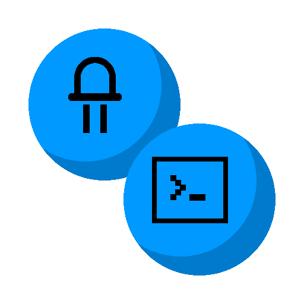

<h2 font-weight="bold" align="center">Proyectos</h2>

Este es un lugar donde podras encontrar programas, paginas, herramientas desarrolladas por otros programadores con la intencion de contribuir con sus pares.

<table align ="center">
    <tr>
        <td align="center"><a href="https://github.com/MITH-arg/EI-Links"> EI-Links</a></td>
        <td align="center"><a href="https://mith-arg.github.io/EI-Materias-Web/"> EI-Materias</a></td>
        <td align="center"><a href="https://mith-arg.github.io/mith-arg/"> MITH.png</a></td>
    </tr>
    <tr>
        <td align="center"><a href="https://j-josu.github.io/RobotScript/"> RobotScript</a></td>
        <td align="center"><a href="https://fabian-martinez1.github.io/Mega-Conversor-OC/"> Mega Conversor OC</a></td>
        <td align="center"><a href="https://vonsim.github.io/"> VONSIM</a></td>
    </tr>

</table>
